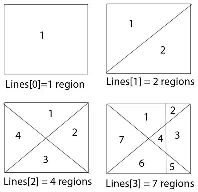

### Explanations:
__N__ straight lines are drawn on a plane paper. Each line intersects with rest all lines. That means __N__'th line intersects __N-1__ lines. You can assume infinite number of lines can be drawn on that paper. You have to find total regions after __N__ lines are drawn. An image is given below to understand the problem clearly.
<!-- more --> 
<center>  </center>

### Solve Approach:
From above picture we see that base case L[0] = 1 (here, L = Lines). Whenever a line is drawn it intersects all other lines. Lets try to find the pattern from the picture. L[1] = 2, When 1st line is drawn it intersects 0 line. So, L[1] =  1+L[0] = 1. When 2'th line is drawn it intersects 1 lines. So, L[2] = 2+L[1] . Because when intersecting 1 line it creates 2 new regions. You can see for yourself by drawing on text paper. Again, when 3rd line is drawn it intersects 2 lines and creates 3 new regions. Thus, L[3] = 3+L[2].
From observation we see that, when N'th line is drawn and it intersects N-1 lines and creates N new regions. The total regions become new regions + old regions. So, for N lines, L[n] = N+L[n-1]. To know answer of L[n] we need to know L[n-1], To know L[n-1] we need to know L[n-2]....and in ending stage L[0]. Thus, we can say that recurrent solution exists for this problem.

Lets build a tree for 4 lines.

<pre>
<center> L[4] </center>
<center> | </center>
<center> L[3]+4 </center>
<center> |    </center>
<center> L[2]+3     </center>
<center> |       </center>
<center> L[1]+2       </center>
<center> |          </center>
<center> L[0]+1           </center>
<center> |              </center>
<center> 1              </center>
</pre>

To calculate L[4], we need to go step by step from bottom to top from above tree.

### Pseudocode for programming ( O(N) Time Complexity )

```
def TotalRegions( N ):
      if N==0: return 1
return TotalRegions(N-1)+N
```

### Mathematical Solution ( O(1) Time Complexity )

We know from above discussions,

<pre>
     L[n] = L[n-1]+n
=>        = L[n-2]+(n-1)+n
=>        = L[n-3]+(n-2)+(n-1)+n
=>        = L[n-4]+(n-3)+(n-2)+(n-1)+n
......................................
......................................
......................................
......................................
=>        = L(n-n)+(n-(n-1))+..........+(n-4)+(n-3)+(n-2)+(n-1)+n
=>        = L[0]+1+2+3+4+..........+n    ; Observing carefully the previous line will help you to understand how this(current line) came.
=>        = 1 + n*(n+1)/2                ; we know summation of 1 to n numbers is (n+1)/2\
=>        = 1 + S(n)                     ; where, S(n) = n*(n+1)/2 = 1+2+3+4+..........+n
</pre>

So, finding 1 + S(n) will let us know the total regions after drawn n lines in a plane.
