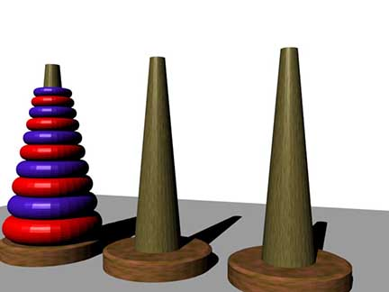
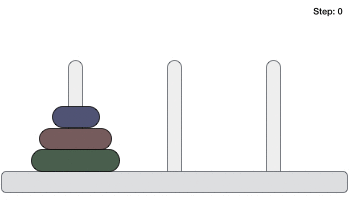

### Definition:
The Tower of Hanoi problem is a puzzle which can be solved by mathematically and can be implemented in programming code as well. The tower is also called __Tower of Brahma__ or __Lucas' Tower__. In this, game there are three pegs and one one of them hold __n__ disks. __n__ disks are ordered from higher radius to lower radius from the bottom to top.
<!-- more -->
<center>  </center>
<center> Illustration of the tower of Hanoi </center>

### Objective:
The _objective_ is to _move all the disks to to another peg_ , __Calculate minimum number of moves needed__ & __stats of three pegs after specific number of moves__. But following conditions have to be fulfilled.
+ Single disk can be moved at a time. No concurrency.
+ Upper disk has to be moved from one peg to another.
+ A disk of higher radius can not be placed on a disk of lower radius.

Following image explains the conditions-
<center>  </center>
<p align="center" ><font size="-4">The gif is collected from tutorialspoint.com</font> </p>
<center> </center>


### Minimum Moves Needed to Finish the Game (Recursive Solutions)

#### Thinking Approach
For ease of remembering, lets think disks are numbered __1__ to __n__ from top to bottom. Now we will explore the puzzle in reverse way. We think first to move __n__'th disk from first peg to third peg. But before that we need to move __n-1__ disks to second peg. Upon completion of moving __n-1__ disks to second we we will move __n__'th disk from first peg to  third peg and then move __n-1__ disks from second peg to third peg.

So, to finish shifting all disks, move orders become -
__move n disks from first peg to third pegs__ = __Move (n-1) disks from first peg to second peg__ + __move n'th disk from first peg to third peg__ + __Move (n-1) disks from second pegs to third peg__.

Equation,
T(n) = T(n-1)+1+T(n-1)

 Now to move __n-1__ disks from first peg to second pegs, initially we need to move __n-2__ disks from first pegs to third pegs then bring __n-1__'th disk from first peg to second peg. Then again move __n-2__ disks from first pegs from third peg to second pegs. So, move orders become -
 __move n-1 disks from first peg to second peg__ =  __move n-2 disks from first peg to third peg__ + __move n-1'th disk from first peg to second peg__ + __move n-2 disks from third peg to second peg__.

Equation,
T(n-1) = T(n-2)+1+T(n-2)

Now will find the solution for T(n-2), T(n-3), T(n-4) ....... T(0). T(0) = 0, as we know that one disk require one move. So, rest equations will be-
T(n-2) = T(n-3)+1+T(n-3)
T(n-3) = T(n-4)+1+T(n-4)
............................................
............................................
............................................
T(1) = T(0)+1+T(0)
T(0)=0

Lets think there are 4 disks. Now I will show a tree to solve the problem for T(4);

<pre>
<center>T(4)</center>
<center>|</center>
<center>T(3)+1+T(3)</center>
<center> /           \ </center>
<center> T(2)+1+T(2)                    T(2)+1+T(2) </center>
<center> /           \                   /           \</center>
<center>T(1)+1+T(1)         T(1)+1+T(1)  T(1)+1+T(1)        T(1)+1+T(1)</center>
</pre>

From above tree we see that the solution of T(n) depends on T(n-1) and T(n-1) depends on T(n-2) and so on until  base case T(0)=0 comes. If we know solution of 0 disk we can find the solution of any number of disks as long as there are three pegs only.

#### Pseudocode for Programming ( O(2^n) Time Complexity)

```
def TotalMoves(N):
  if N == 0: return 0
  return TotalMoves(N-1)+1+TotalMoves(N-1)
```

We can optimize above pseudocode for better time complexity. We do not need to call __TotalMoves(N-1)__ twice. Rather we can just write __2*TotalMoves(N-1)__ there. Pseudocode will become -
```
def TotalMoves(N):
  if N == 0: return 0
  return 2*TotalMoves(N-1)+1
```

The time complexity of above code is O(2^n). We can bring it to linear time by doing some math. See below for linear solution.

#### Mathematical Solution ( O(1) Time Complexity )

From above discussions of recursive solution of The Tower of Hanoi, we can write the recurrence relation. The relation is -
__T(n)=2*T(n-1)+1__
<pre>
we know, T[0] = 0

Let, U[n] = T[n]+1
So,  U[0] = T[0]+1
=>        = 1

Now, U[n] = T[n]+1
=>        = (2*T[n-1]+1)+1  ; From equation, we know T[n] = 2*T[n-1]+1
=>        = 2*T[n-1]+2
=>        = 2*(T[n-1]+1)
=>        = 2*U[n-1]
=>        = 2*2*U[n-2]
=>        = 2*2*2*U[n-3]
    ...................   
    ...................
    ...................
=>        = 2*2*2*...2*1
=>   U[n] = 2^n  ; At finishing stage total number of 2 will be n.
=>   T[n]+1 = 2^n
=>   T[n] = 2^n-1
</pre>

__T[n] = 2^n-1__ is the equation to count minimum moves need to finish the Tower of Hanoi game. Note, if we know the mathematical equation of The tower of Hanoi problem then we can find the solution in linear time.
