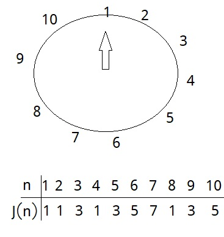
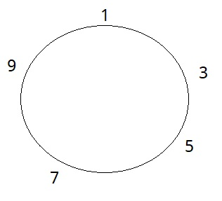
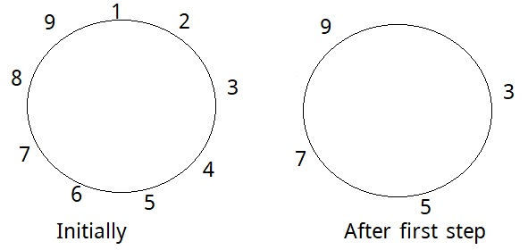

### Introduction
The __Josephus Problem__ is a count-out game which is regarded as a theoretical problem in Computer Science or Mathematics. In this game, __n__ people stand in a circle __s__ is the starting number of people. __s__ is holding a sword where __s__ kills __s+k-1__'th people from his position and gives his sword to __s+k__'th people. Thus __s+k__ becomes new __s__.<!-- more --> Going in the same direction this procedure is repeated until one person is left. Remaining one person is marked as a winner.
The gif below explains the procedure. Here n = 12, k = 3 & s = 1.


To know history of Josephus Problem you can read the wiki page.

### Solutions


#### Simulation ( When k=2 & s = 1)
Look carefully below image.


I've manually sorted the solution for n = 1 to 10.

#### Method 1 (when k=2)
##### Solution by Simulations
If __n__ is even then--
Now suppose n = 10, after first step the image becomes like  


The person holding the sword after first step is 2&ast;(n/2)-1. Let, x = n. For every choice of x   the position at the end of that stage will be 2&ast;(x/2)-1. You can see it from the above images. If x is even after that stage then this recursive procedure will continue. So, for __2n__ people we can write J(2n) = 2J(n)-1.

If total people is odd or there are __2n+1__ people then--


At the end of the step 1, number 9 is holding the sword. So for 2n+1 we can write, J(2n+1) = 2J(n)+1.
So, Finally
          J(1) = 1
          J(2n) = 2J(n)-1  while n>=1
          J(2n+1) = 2J(n)+1 while n>=1


##### Pseudocode

```
  def Josephus(n):
      if n==1: return 1

      if n is even return 2*J(n/2)-1
      return 2*J(n/2)+1
```

#### Method 2 (k=2)
##### Proof by Induction

J(2^m +L) = 2L+1
<pre>
Base Case: J(1) = 1

Induction Steps:
  Case 1: (L is even)
        J(2^m +L) = 2J(2^(m-1) + (L/2) ) - 1
                  = 2 (2L/2 + 1 ) -1
                  = 2L+1

  Case 2: (L is odd)
        J(2^m +L)
        let, 2^m +L = 2K+1
        K = (2^m + L-1)/2
          = 2^(m-1) + (L-1)/2
        J(2^m+L) = 2J(2^(m-1) + (L-1)/2 ) +1
                 = 2 [2(L-1)/2 + 1 ] +1
                 = 2 [ L-1+1] + 1
                 = 2L+1
  So, Proved
</pre>

#### Method 3 (k=2)
##### Binary Solution
Suppose, n = 10 then binary of 10 = 1010. Shifting the leftmost 1's bit to Rightmost position makes 0101. The decimal of 0101 is 5, which is answer. So, shifting leftmost 1's digit of a binary number to it's rightmost position makes the winner number in Josephus problem.
